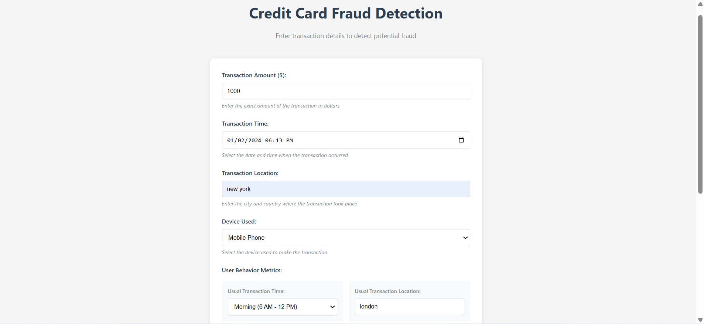
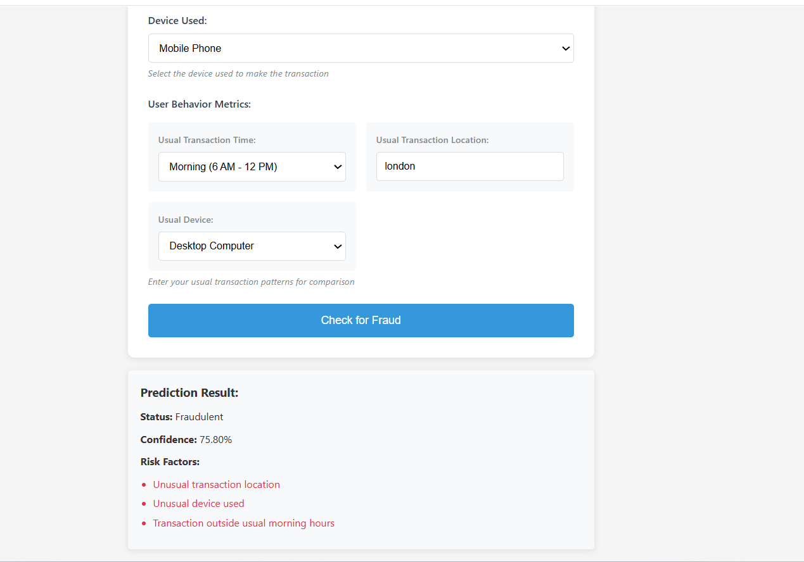

# Credit Card Fraud Detection System

A machine learning-based system for detecting fraudulent credit card transactions using LSTM neural networks.

##  UI Screenshot

This is the main fraud detection interface:




##  Prediction Result

Here's what the prediction output looks like:




## Features

- Real-time fraud detection
- Multiple risk factor analysis
- User behavior pattern recognition
- Web interface for transaction verification
- Historical transaction analysis

## Technologies Used

- Python 3.8+
- Flask
- PyTorch
- scikit-learn
- NumPy
- Pandas

## Installation

1. Clone the repository:
```bash
git clone https://github.com/yourusername/credit-card-fraud-detection.git
cd credit-card-fraud-detection
```

2. Create a virtual environment:
```bash
python -m venv venv
source venv/bin/activate  # On Windows: venv\Scripts\activate
```

3. Install dependencies:
```bash
pip install -r requirements.txt
```

## Usage

1. Train the model:
```bash
python model.py
```

2. Start the Flask server:
```bash
python app.py
```

3. Open your browser and navigate to:
```
http://localhost:5000
```

## 📁 Project Structure

```text
credit-card-fraud-detection/
├── app.py              # Flask web application
├── model.py            # LSTM model implementation
├── templates/          # HTML templates
├── assets/             # App Screenshots
├── static/             # CSS and JavaScript files
├── requirements.txt    # Project dependencies
└── README.md           # Project overview

```

## Contributing

1. Fork the repository
2. Create your feature branch (`git checkout -b feature/AmazingFeature`)
3. Commit your changes (`git commit -m 'Add some AmazingFeature'`)
4. Push to the branch (`git push origin feature/AmazingFeature`)
5. Open a Pull Request

## License

This project is licensed under the MIT License - see the LICENSE file for details.

## Local Development
1. Install dependencies:
```bash
pip install -r requirements.txt
```

2. Run the application:
```bash
python app.py
```

3. Access the application at `http://localhost:5000`


## Environment Variables
No environment variables are required for this application.

## Dataset

The model is trained on the Credit Card Fraud Detection dataset from Kaggle. The dataset contains transactions made by credit cards in September 2013 by European cardholders.
